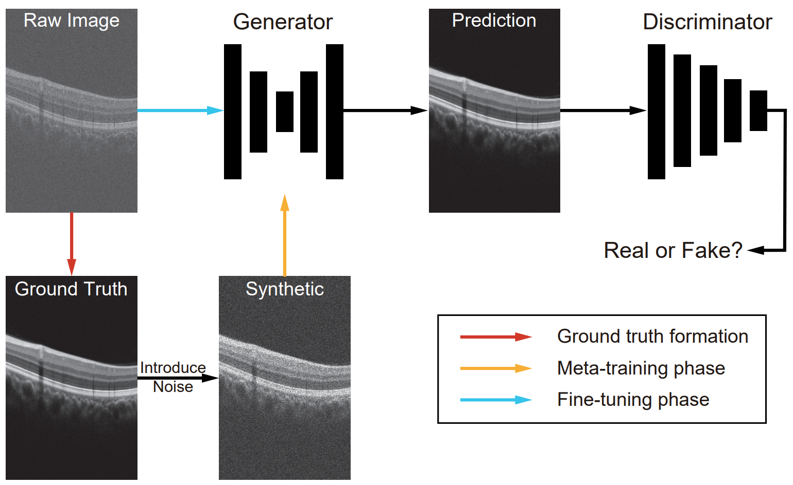

# AMeta-FD: Adversarial Meta-learning for Few-shot Retinal OCT Image Despeckling

## Overview

<center>

</center>

###  [Paper](https://www.sciencedirect.com/science/article/abs/pii/S0895611125001065) | [BibTex](#jump1)
## Get Started

Using the ```train.py``` to train the model on your own dataset, where ```ML_mode``` controls whether add the synthetic noise. 

<span id="jump1"></span>
## Citation
If you use this code for your research, please cite our papers. 
```
@article{zhou2025ameta,
  title={AMeta-FD: Adversarial Meta-learning for Few-shot retinal OCT image Despeckling},
  author={Zhou, Yi and Peng, Tao and Ahmed, Thiara Sana and Shi, Fei and Zhu, Weifang and Xiang, Dehui and Schmetterer, Leopold and Jiang, Jianxin and Tan, Bingyao and Chen, Xinjian},
  journal={Computerized Medical Imaging and Graphics},
  pages={102597},
  year={2025},
  publisher={Elsevier}
}
```